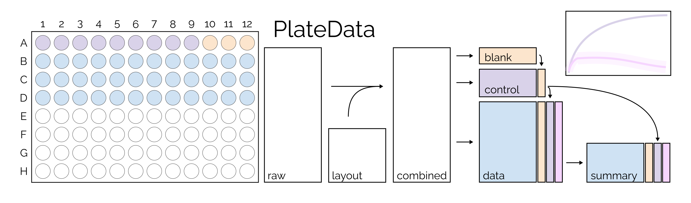

# PlateData


R package for the analysis of microtiter plate-based data. Data usually comes from spectrophotometers measuring optical density (OD), fluorescence or luminescence across time, either in cycles or minutes.

Raw data is imported by device-specific import functions (e.g. import_tekanSpark), layout by a single import function (import_layout) based on a (very simple) template in excel format.

Raw data and layout are combined using a key created from plate and well (which are mandatory columns in both tables), for example the key P1_A1 from plate P1 and well A1. If multiple plates are combined, the run identifier can be added as part of the plate, for example run-10_P1 giving the key run-10_P1_A1. 

> How is containment of keys checked?

The PlateData object stores imported measurements ('raw') and 'layout' as data.frames. Internally, raw and layout are merged into 'combined' by the key and split into 'blank', 'control', and 'data'. Blank and control are summarized from replicates into mean and standard deviation (sd), the summarized values of data are stored in 'summary'.

Blank and controls are assigned by ...

Uncertainty propagation ...

The plate type (e.g. 6-well, 24-well, 96-well is determined automatically and stored as 'type').



## Installation
There is no official release version yet, since the package is under development.

You can install the development version from GitHub using the `remotes` package:
```
remotes::install_github("OliverDietrich/PlateData@main")
```

> [!WARNING]
> Early development, no stable features.
> 

## Usage
Tutorials are available in [vignettes](vignettes/) that show typical use cases

### Single plate with OD measurments

### Multiple plates with OD measurements

### More complex analyses
